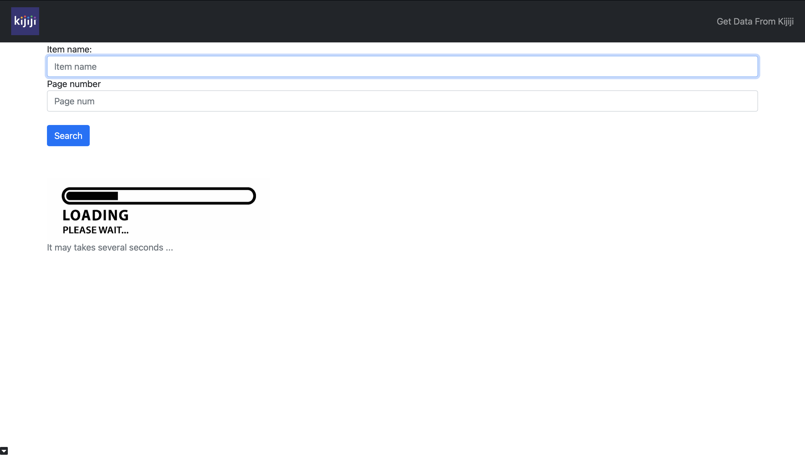
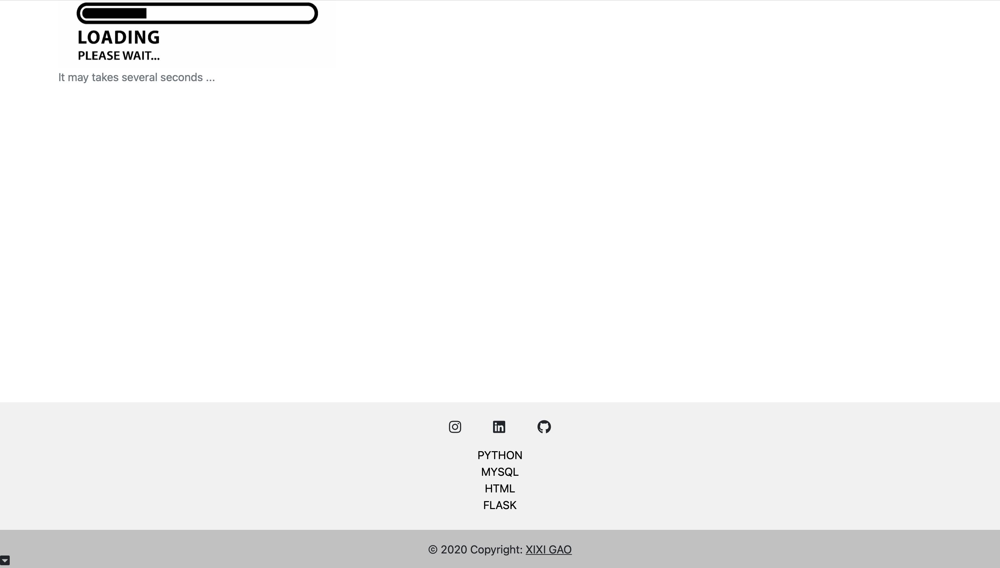
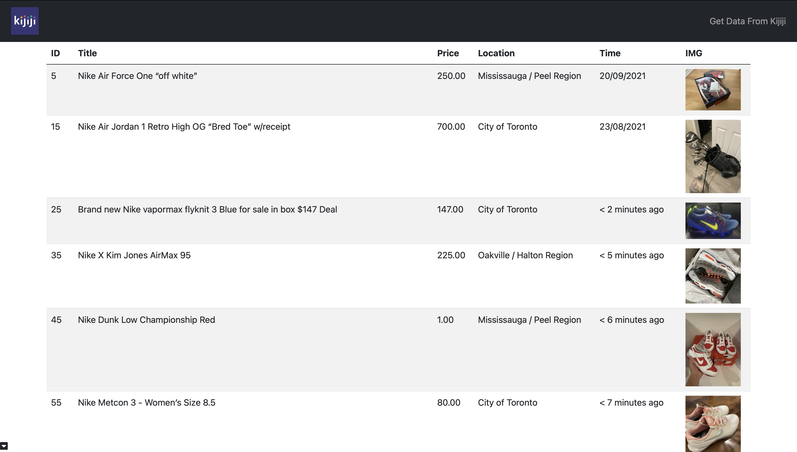
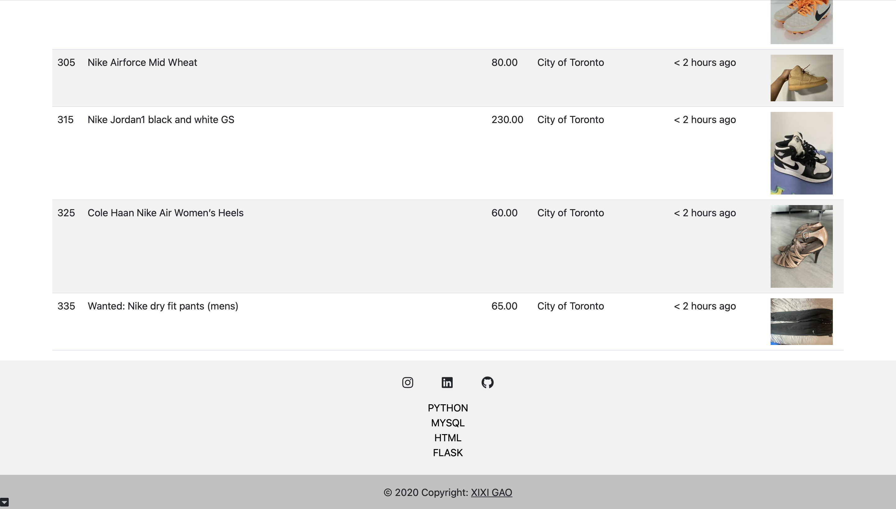

# webscraping-kijiji
Python, mysql, flask, html
### check my website [scrape from kijiji](https://scrape-kijiji.herokuapp.com/).

## Why I made this project?
When I first came to Canada, I need to buy many things, that's why I found kijiji.
But after using a lot, I found When I search some thing, ads and irrevent recordings shown up. Pretty annoying!
So I decide to make my own api to simplify searching.

## My project
When you click the link:

Scroll down, showing my social media

After input the item_name and page number, for example (nike, 1).
Jump to *https://scrape-kijiji.herokuapp.com/scrape?item_name=nike&page_num=1*


*reminder:Heroku ClearDB Id's offset is 10*

## How to use the code
Down load my code, using pipenv envrionment
```
python -m flask run
```
Please change to your own DB

## Thanks to Lam ins@lamseyed
Helped me a lot with my project
